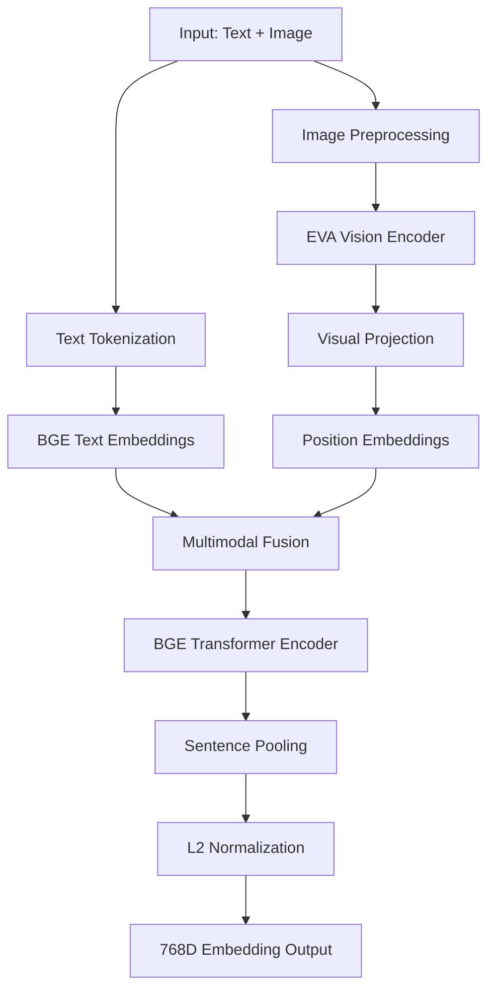

# Design Document

## Overview

This design document outlines the technical approach for implementing BGE Visualized in Jax using Flax NNX. The implementation will create a clean, modern multimodal embedding model that combines EVA02-CLIP-B-16 vision encoder with BGE-base-en-v1.5 text encoder to produce 768-dimensional unified embeddings.

The design follows functional programming principles inherent to Jax while leveraging Flax NNX's object-oriented patterns for model definition. The architecture maintains the early fusion approach of the original PyTorch implementation but simplifies the codebase by fixing the model configuration and removing dynamic model selection logic.

## Architecture

### High-Level Architecture



### Module Structure

The implementation will be organized into the following modules:

1. **Core Model** (`bge_visualized_jax/model.py`)
   - Main `BGEVisualized` class using Flax NNX
   - Orchestrates all components and encoding modes

2. **Vision Components** (`bge_visualized_jax/vision.py`)
   - EVA02-CLIP-B-16 vision transformer implementation
   - Image preprocessing and patch embedding extraction

3. **Text Components** (`bge_visualized_jax/text.py`)
   - BGE text encoder implementation
   - Tokenization and text embedding layers

4. **Multimodal Fusion** (`bge_visualized_jax/fusion.py`)
   - Visual projection layer
   - Position embedding management
   - Attention mask creation for combined sequences

5. **Weight Conversion** (`bge_visualized_jax/convert_weights.py`)
   - PyTorch to Flax NNX weight conversion utility
   - Parameter name mapping and validation

6. **Configuration** (`bge_visualized_jax/config.py`)
   - Model configuration dataclasses
   - Default parameters and constants

## Components and Interfaces

### BGEVisualized Main Class

```python
class BGEVisualized(nnx.Module):
    """Main BGE Visualized model for multimodal embedding generation."""
    
    def __init__(self, config: BGEVisualizedConfig, rngs: nnx.Rngs):
        # Initialize vision encoder, text encoder, and fusion components
        
    def encode_text(self, input_ids: jax.Array, attention_mask: jax.Array) -> jax.Array:
        """Encode text-only inputs to embeddings."""
        
    def encode_image(self, images: jax.Array) -> jax.Array:
        """Encode image-only inputs to embeddings."""
        
    def encode_multimodal(self, images: jax.Array, input_ids: jax.Array, 
                         attention_mask: jax.Array) -> jax.Array:
        """Encode combined image and text inputs to embeddings."""
        
    def __call__(self, images: Optional[jax.Array] = None, 
                 input_ids: Optional[jax.Array] = None,
                 attention_mask: Optional[jax.Array] = None) -> jax.Array:
        """Main forward pass with automatic mode detection."""
```

### Vision Encoder

```python
class EVAVisionEncoder(nnx.Module):
    """EVA02-CLIP-B-16 vision transformer encoder."""
    
    def __init__(self, config: VisionConfig, rngs: nnx.Rngs):
        # Initialize patch embedding, transformer blocks, layer norm
        
    def __call__(self, images: jax.Array) -> jax.Array:
        """Extract patch embeddings from images."""
        # Returns [batch_size, num_patches + 1, hidden_dim]
        # Includes CLS token that will be excluded in fusion
```

### Text Encoder

```python
class BGETextEncoder(nnx.Module):
    """BGE-base-en-v1.5 text encoder implementation."""
    
    def __init__(self, config: TextConfig, rngs: nnx.Rngs):
        # Initialize embeddings, transformer layers, pooling
        
    def __call__(self, input_ids: jax.Array, attention_mask: jax.Array,
                 position_ids: Optional[jax.Array] = None) -> jax.Array:
        """Process text tokens through BGE encoder."""
```

### Multimodal Fusion

```python
class MultimodalFusion(nnx.Module):
    """Handles fusion of visual and textual representations."""
    
    def __init__(self, config: FusionConfig, rngs: nnx.Rngs):
        # Initialize visual projection layer
        
    def fuse_modalities(self, visual_features: jax.Array, text_embeddings: jax.Array,
                       attention_mask: jax.Array) -> Tuple[jax.Array, jax.Array]:
        """Combine visual and text features with proper positioning."""
        # Returns combined embeddings and extended attention mask
```

## Data Models

### Configuration Classes

```python
@dataclass
class BGEVisualizedConfig:
    """Main configuration for BGE Visualized model."""
    hidden_dim: int = 768
    num_layers: int = 12
    normalized: bool = True
    sentence_pooling_method: str = 'cls'  # 'cls' or 'mean'
    temperature: float = 0.02
    
@dataclass 
class VisionConfig:
    """Configuration for EVA vision encoder."""
    image_size: int = 224
    patch_size: int = 16
    num_channels: int = 3
    hidden_dim: int = 768
    num_heads: int = 12
    num_layers: int = 12
    
@dataclass
class TextConfig:
    """Configuration for BGE text encoder."""
    vocab_size: int = 30522
    hidden_dim: int = 768
    num_heads: int = 12
    num_layers: int = 12
    max_position_embeddings: int = 512
```

### Input/Output Interfaces

```python
@dataclass
class ModelInputs:
    """Structured input for the model."""
    images: Optional[jax.Array] = None  # [batch_size, height, width, channels]
    input_ids: Optional[jax.Array] = None  # [batch_size, seq_len]
    attention_mask: Optional[jax.Array] = None  # [batch_size, seq_len]

@dataclass
class ModelOutputs:
    """Structured output from the model."""
    embeddings: jax.Array  # [batch_size, hidden_dim]
    pooled_output: Optional[jax.Array] = None
```

## Error Handling

### Input Validation

1. **Empty Inputs**: Validate that at least one of images or text is provided
2. **Shape Validation**: Ensure input tensors have expected dimensions
3. **Device Consistency**: Verify all inputs are on the same device
4. **Batch Size Consistency**: Ensure image and text batch sizes match when both provided

### Weight Loading Errors

1. **Missing Parameters**: Handle cases where PyTorch weights don't map to expected Flax parameters
2. **Shape Mismatches**: Validate that converted weights have correct shapes
3. **Numerical Validation**: Compare outputs before and after conversion to ensure correctness

### Runtime Errors

1. **Memory Management**: Handle large batch sizes gracefully
2. **Numerical Stability**: Apply appropriate clipping and normalization
3. **Gradient Flow**: Ensure proper gradient computation in training mode

## Testing Strategy

### Unit Tests

1. **Component Testing**: Test each module (vision, text, fusion) independently
2. **Shape Testing**: Verify output shapes for all input combinations
3. **Numerical Testing**: Compare outputs with PyTorch implementation within tolerance
4. **Edge Case Testing**: Test with empty strings, single pixels, extreme batch sizes

### Integration Tests

1. **End-to-End Testing**: Test complete encoding pipeline for all modes
2. **Weight Conversion Testing**: Validate converted weights produce identical outputs
3. **Performance Testing**: Benchmark against PyTorch implementation
4. **Memory Testing**: Verify memory usage is reasonable for large inputs

### Validation Tests

1. **Equivalence Testing**: Ensure mathematical equivalence with PyTorch version
2. **Reproducibility Testing**: Verify deterministic outputs with fixed seeds
3. **Gradient Testing**: Validate gradient computation for training scenarios

## Implementation Approach

### Phase 1: Core Infrastructure
- Set up project structure and dependencies
- Implement configuration classes and basic interfaces
- Create weight conversion utility framework

### Phase 2: Individual Components
- Implement EVA vision encoder
- Implement BGE text encoder  
- Create multimodal fusion logic

### Phase 3: Integration and Testing
- Integrate components into main BGEVisualized class
- Implement weight conversion from PyTorch checkpoint
- Add comprehensive test suite

### Phase 4: Optimization and Validation
- Optimize performance and memory usage
- Validate numerical equivalence with PyTorch
- Add documentation and examples

## Dependencies

### Core Dependencies
- `jax`: Core JAX library for array operations
- `flax`: Flax NNX for neural network modules
- `transformers`: For tokenizer compatibility
- `torch`: For loading PyTorch weights (conversion only)
- `numpy`: For array manipulations during conversion

### Development Dependencies
- `pytest`: Testing framework
- `pytest-benchmark`: Performance testing
- `pillow`: Image processing for examples
- `matplotlib`: Visualization for debugging

## Performance Considerations

### Memory Optimization
- Use gradient checkpointing for large models
- Implement efficient attention mechanisms
- Optimize batch processing for variable sequence lengths

### Computational Efficiency
- Leverage JAX's JIT compilation for performance
- Use efficient matrix operations for similarity computation
- Implement proper batching strategies for different input modes

### Scalability
- Support variable batch sizes efficiently
- Handle large images through proper preprocessing
- Optimize for both single-sample and batch inference